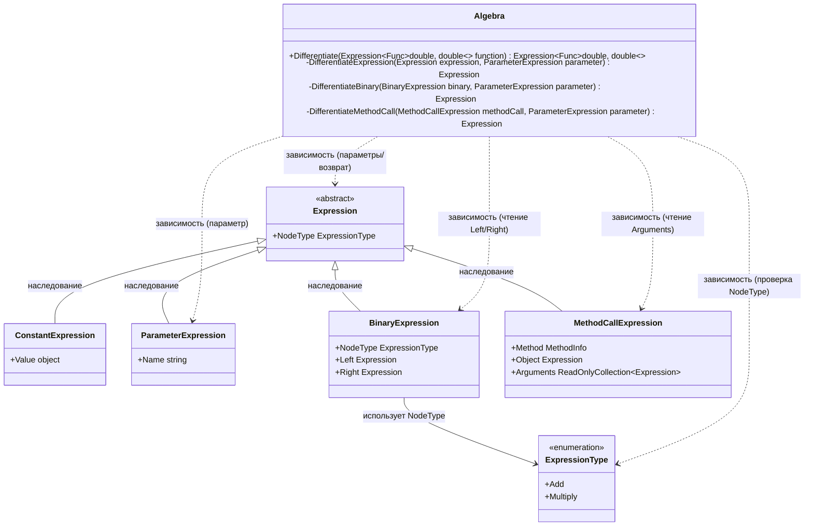

# Практика: Генератор отчетов

## 1. Описание предметной области и сущностей
Программа преобразует математическое выражение в его производную, при этом обходя дерево выражения и применяя правила дифференцирования.

Algebra	- главный класс, содержит логику дифференцирования. Принимает выражение, рекурсивно обходит его узлы и возвращает новое выражение (производную).

Expression - абстрактный базовый класс для всех узлов дерева выражения. Представляет собой математическую формулу.

ConstantExpression - константа (число). При дифференцировании превращается в 0.

ParameterExpression	- переменная, по которой дифференцируем. При дифференцировании превращается в 1.

BinaryExpression - бинарный оператор с левым и правым операндом. Поддерживаются сложение и умножение.

MethodCallExpression - вызов математической функции. Поддерживаются Sin и Cos.

ExpressionType - перечисление типов узлов. Используется для определения оператора (Add, Multiply) в бинарных выражениях.

## 2. Диаграмма классов (Mermaid)

