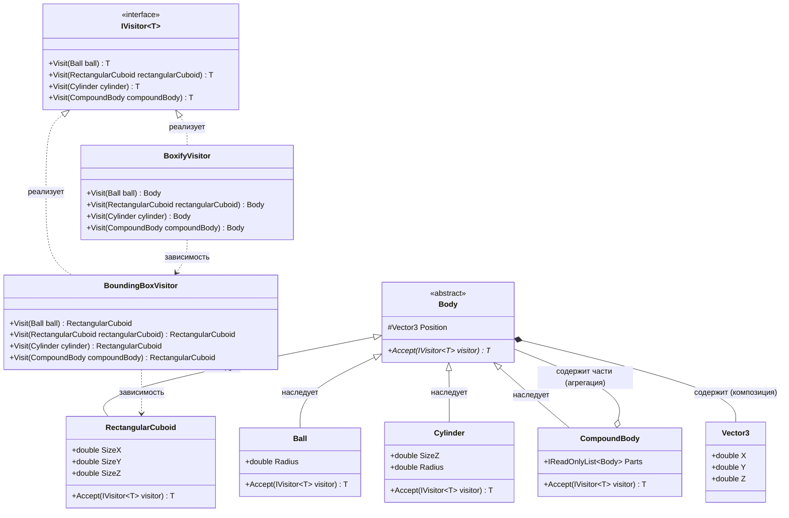

# Практика: Геомeтрия-2

## 1. Описание предметной области и сущностей
Body - абстрактный базовый класс, содержит позицию фигуры в пространстве и абстрактный метод Accept для принятия посетителя.

Ball - шар, наследник Body, имеет радиус.

RectangularCuboid - прямоугольный параллелепипед, наследник Body, имеет размеры по трём осям SizeX, SizeY, SizeZ.

Cylinder - цилиндр, наследник Body, имеет радиус и высоту SizeZ.

CompoundBody - составное тело, наследник Body, содержит список других тел (Parts).

Vector3 - вспомогательная структура, хранящая координаты X, Y, Z.

IVisitor\<T\> - интерфейс, определяющий методы Visit для каждого типа фигуры.

BoundingBoxVisitor - посетитель, реализует IVisitor\<RectangularCuboid\>, вычисляет минимальный ограничивающий параллелепипед для фигуры.

BoxifyVisitor - посетитель, реализует IVisitor\<Body\>, заменяет каждое простое тело на его ограничивающий параллелепипед.

## 2. Диаграмма классов (Mermaid)

