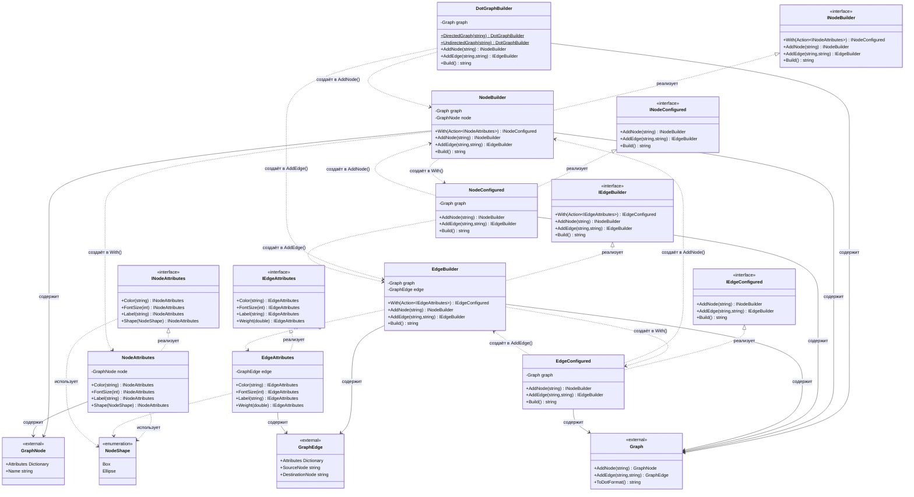

# Практика: GraphViz

## 1. Описание предметной области и сущностей
Система предназначена для построения графов в формате DOT с использованием Fluent API. Она позволяет создавать ориентированные и неориентированные графы, добавлять вершины и рёбра с атрибутами, а затем генерировать текстовое представление графа в формате, совместимом с GraphViz.

INodeAttributes - интерфейс настройки атрибутов вершины: цвет, размер шрифта, метка, форма. Поддерживает цепочку вызовов.

IEdgeAttributes - интерфейс настройки атрибутов ребра: цвет, размер шрифта, метка, вес. Поддерживает цепочку вызовов.

INodeBuilder - построитель вершины до применения атрибутов. Содержит метод With для настройки, методы добавления элементов и Build.

INodeConfigured - построитель вершины после применения атрибутов. Не содержит With, предотвращает повторную настройку.

IEdgeBuilder - построитель ребра до применения атрибутов. Содержит метод With для настройки, методы добавления элементов и Build.

IEdgeConfigured - построитель ребра после применения атрибутов. Не содержит With, предотвращает повторную настройку.

DotGraphBuilder - точка входа в библиотеку. Статические методы DirectedGraph/UndirectedGraph создают граф. Методы AddNode/AddEdge добавляют элементы, Build генерирует DOT-представление.

NodeBuilder - внутренняя реализация INodeBuilder. Хранит Graph и GraphNode. With создаёт NodeAttributes и возвращает NodeConfigured.

NodeConfigured - внутренняя реализация INodeConfigured. Хранит Graph. Не имеет With. Создаёт новые билдеры через AddNode/AddEdge.

EdgeBuilder - внутренняя реализация IEdgeBuilder. Хранит Graph и GraphEdge. With создаёт EdgeAttributes и возвращает EdgeConfigured.

EdgeConfigured - внутренняя реализация IEdgeConfigured. Хранит Graph. Не имеет With. Создаёт новые билдеры через AddNode/AddEdge.

NodeAttributes - внутренняя реализация INodeAttributes. Хранит GraphNode. Записывает атрибуты в словарь вершины. Возвращает this для цепочки вызовов.

EdgeAttributes - внутренняя реализация IEdgeAttributes. Хранит GraphEdge. Записывает атрибуты в словарь ребра. Возвращает this для цепочки вызовов.

Graph - внешний класс-хранилище графа. Содержит коллекции вершин и рёбер. Методы AddNode/AddEdge для добавления, ToDotFormat для генерации DOT.

GraphNode - внешний класс вершины. Содержит словарь атрибутов и свойство Name.

GraphEdge - внешний класс ребра. Содержит словарь атрибутов, свойства SourceNode, DestinationNode и флаг Directed.

NodeShape - перечисление форм вершины: Box и Ellipse. Используется в INodeAttributes.

## 2. Диаграмма классов (Mermaid)

