# Практика: HoMM

## 1. Описание предметной области и сущностей
Player - игрок. Он может побеждать армии, получать сокровища, присваивать объекты и погибать при поражении.

Interaction - обработка взаимодействия игрока с объектами карты. 

IMapObject - общий интерфейс для всех объектов карты.

IOwnable - интерфейс объектов, могут принадлежать игроку и иметь владельца.

IHaveArmy - интерфейс объектов, содержат армию и могут участвовать в бою с игроком.

IHaveTreasure - интерфейс объектов, содержат сокровища и могут быть получены игроком.

Dwelling - объект карты, может принадлежать игроку.

Mine - объект карты, может принадлежать игроку, содержит армию и сокровища.

Creeps - объект карты, содержит армию и сокровища, не имеет владельца.

Wolves - объект карты, содержит только армию.

ResourcePile - объект карты, содержит только сокровища.

Army - сущность, боевая сила объекта.

Treasure - сущность, описывает описывающая награду игрока.

## 2. Диаграмма классов (Mermaid)

```mermaid
classDiagram

class IMapObject {
    <<interface>>
}

class IOwnable {
    <<interface>>
    +Owner : int
}

class IHaveArmy {
    <<interface>>
    +Army : Army
}

class IHaveTreasure {
    <<interface>>
    +Treasure : Treasure
}

class Dwelling {
    +Owner : int
}

class Mine {
    +Owner : int
    +Army : Army
    +Treasure : Treasure
}

class Creeps {
    +Army : Army
    +Treasure : Treasure
}

class Wolves {
    +Army : Army
}

class ResourcePile {
    +Treasure : Treasure
}

class Interaction {
    +Make(Player, IMapObject)
}

class Player {
    +Id : int
}

class Army {
    +Strength : int
}

class Treasure {
    +Value : int
}

IMapObject <|.. Dwelling
IMapObject <|.. Mine
IMapObject <|.. Creeps
IMapObject <|.. Wolves
IMapObject <|.. ResourcePile

IOwnable <|.. Dwelling
IOwnable <|.. Mine

IHaveArmy <|.. Mine
IHaveArmy <|.. Creeps
IHaveArmy <|.. Wolves

IHaveTreasure <|.. Mine
IHaveTreasure <|.. Creeps
IHaveTreasure <|.. ResourcePile

Mine o-- Army : содержит
Mine o-- Treasure : награда

Creeps o-- Army : содержит
Creeps o-- Treasure : награда

Wolves o-- Army : содержит

ResourcePile o-- Treasure : содержит

Interaction ..> Player : использует
Interaction ..> IMapObject : обрабатывает
```

