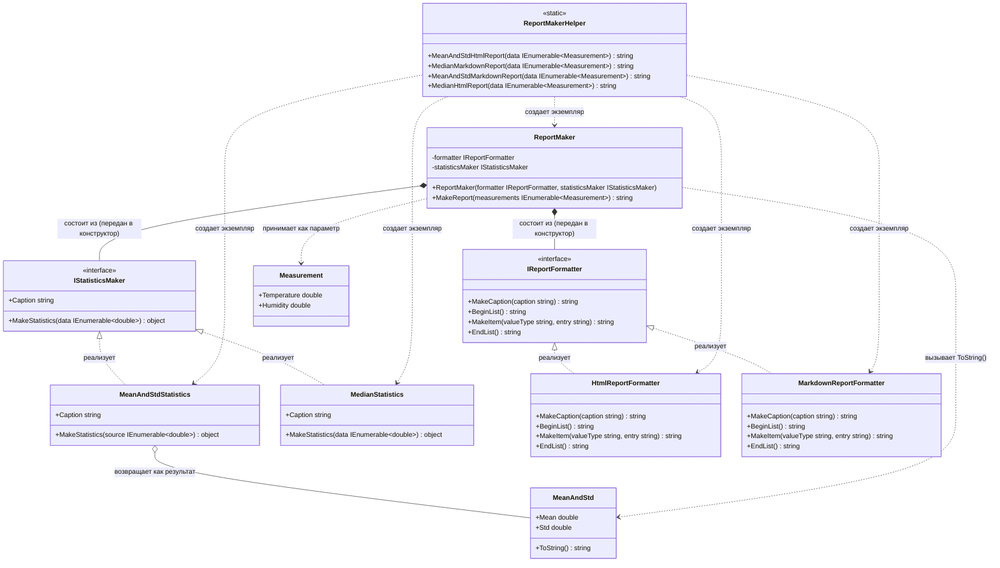

# Практика: Генератор отчетов

## 1. Описание предметной области и сущностей
Система генерации статистических отчетов о погодных измерениях. Вычисляет статистические показатели (среднее, стандартное отклонение, медиану) по двум параметрам (температура и влажность) за несколько дней и выводит результаты в форматах HTML, Markdown.

Measurement - исходное погодное измерение с температурой и влажностью

MeanAndStd - результат вычисления, хранит среднее и стандартное отклонение

IStatisticsMaker - интерфейс вычислителя статистики, определяет название и метод вычисления

MeanAndStdStatistics - вычисляет среднее и стандартное отклонение, реализует IStatisticsMaker

MedianStatistics - вычисляет медиану набора чисел, реализует IStatisticsMaker

IReportFormatter - интерфейс форматтера отчета, определяет методы оформления (заголовок, списки, элементы)

HtmlReportFormatter - форматтер для HTML, реализует IReportFormatter

MarkdownReportFormatter - форматтер для Markdown, реализует IReportFormatter

ReportMaker - главный класс, комбинирует форматтер и вычислитель для создания отчета

ReportMakerHelper - статическая фабрика с 4 готовыми методами для всех комбинаций форматов и статистик
## 2. Диаграмма классов (Mermaid)

