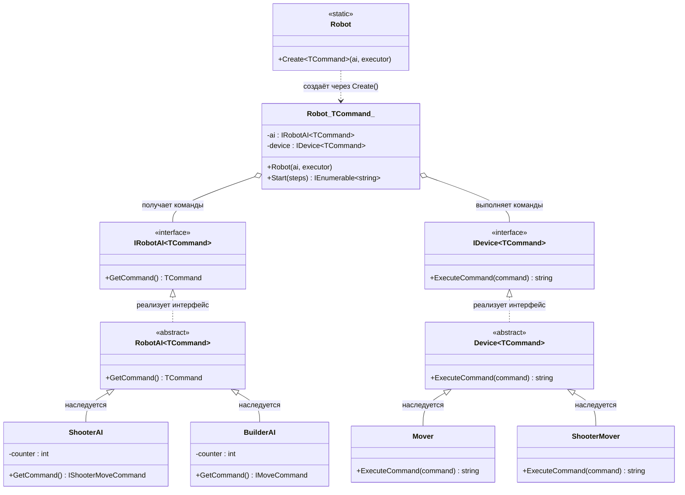

# Практика: Роботы

## 1. Описание предметной области и сущностей
Система управления роботами, состоит из двух ключевых компонентов: интеллектуальной системы управления (AI) и исполнительного устройства (Device). AI генерирует команды, а Device их выполняет.

IRobotAI<TCommand> - интерфейс искусственного интеллекта робота. Определяет метод получения команды для выполнения.

RobotAI<TCommand> - абстрактный базовый класс искусственного интеллекта. Содержит общий контракт для генерации команд и служит основой для реализаций AI.

ShooterAI - реализация искусственного интеллекта боевого робота. Генерирует команды типа IShooterMoveCommand.

BuilderAI - реализация искусственного интеллекта строительного робота. Генерирует команды типа IMoveCommand.

IDevice<TCommand> - интерфейс устройства робота. Определяет метод выполнения полученной команды.

Device<TCommand> - абстрактный базовый класс устройства. Задает общий контракт для исполнения команд различных типов.

Mover - устройство перемещения робота. Выполняет команды типа IMoveCommand.

ShooterMover - устройство перемещения боевого робота. Выполняет команды типа IShooterMoveCommand.

Robot<TCommand> - основной класс робота. Объединяет искусственный интеллект и устройство, организуя процесс получения и выполнения команд.

Robot - статический класс. Предоставляет метод Create, который создает экземпляры роботов.

## 2. Диаграмма классов (Mermaid)

