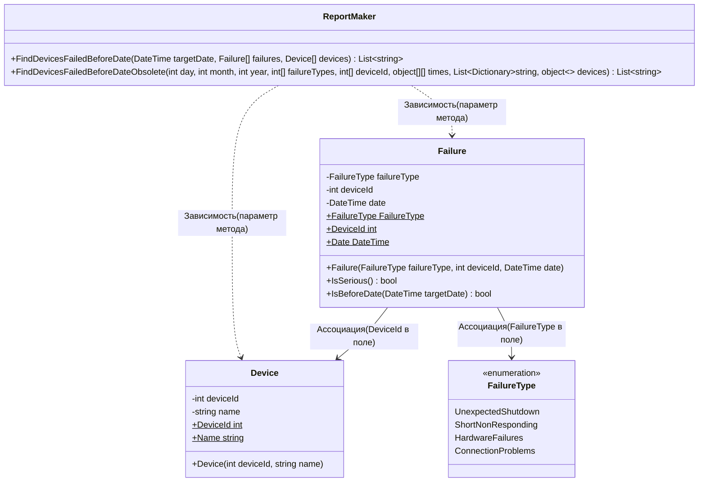

# Практика: Сбои 

## 1. Описание предметной области и сущностей
Device - устройство, хранит идентификатор устройства DeviceId и его название Name. 
Failure - сбой, включает тип сбоя FailureType, DeviceId и дату возникновения Date. Предоставляет методы IsSerious() для определения серьёзности сбоя и IsBeforeDate() для проверки даты.
FailureType - четыре типа сбоев UnexpectedShutdown (0), ShortNonResponding (1), HardwareFailures (2), ConnectionProblems (3). 
ReportMaker - отчёт об устройствах с критическими сбоями до указанной даты. Новый метод принимает дату, массив сбоев и массив устройств. 

## 2. Диаграмма классов (Mermaid)

