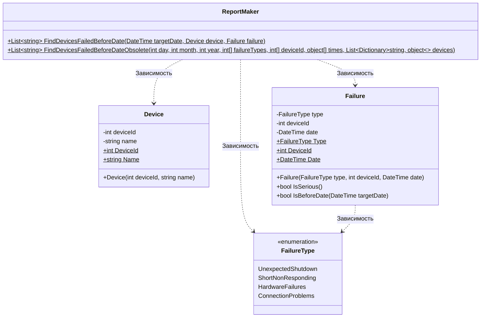

# Практика: Сбои 

## 1. Описание предметной области и сущностей
Система предназначена для анализа критических сбоев оборудования. Необходимо определить, какие устройства имели серьёзные сбои до определённой даты.

Device - устройство, хранит идентификатор DeviceId и название Name.

Failure - содержит тип сбоя FailureType, идентификатор устройства DeviceId и дату Date. Предоставляет методы IsSerious() и IsBeforeDate().

FailureType - типы сбоев UnexpectedShutdown (0), ShortNonResponding (1), HardwareFailures (2), ConnectionProblems (3).

ReportMaker - статический метод FindDevicesFailedBeforeDate принимает дату, одно устройство Device и один сбой Failure. 

## 2. Диаграмма классов (Mermaid)

