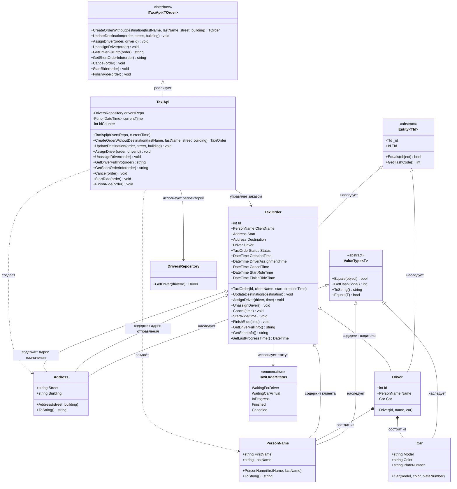

# Практика: TaxiOrder

## 1. Описание предметной области и сущностей
Система управления заказами такси. Система позволяет клиентам создавать заказы, назначать водителей, отслеживать статус выполнения заказа, управлять поездкой и завершать её. Основными участниками процесса являются клиенты, водители и диспетчерская служба.

ValueType<T> - абстрактный базовый класс для всех объектов-значений, обеспечивает сравнение по содержимому свойств через Equals, GetHashCode, ToString

Entity<TId> - абстрактный базовый класс для всех сущностей, обеспечивает наличие Id и сравнение по нему

ITaxiApi<TOrder> - интерфейс, определяет контракт внешнего API для управления заказами такси

PersonName - объект-значение, хранит имя и фамилию клиента или водителя

Address - объект-значение, хранит улицу и номер дома для адреса отправления или назначения

Car - объект-значение, хранит модель, цвет и госномер автомобиля водителя

Driver - сущность водителя, содержит идентификатор, имя и автомобиль

TaxiOrder - корень агрегата, управляет жизненным циклом заказа такси, хранит клиента, адреса, водителя, статус и временные метки событий

DriversRepository - репозиторий для получения данных о водителях из базы данных по идентификатору

TaxiApi - фасадный класс, предоставляет внешний интерфейс, делегирует вызовы методам TaxiOrder

TaxiOrderStatus - перечисление состояний заказа: WaitingForDriver, WaitingCarArrival, InProgress, Finished, Canceled

## 2. Диаграмма классов (Mermaid)

